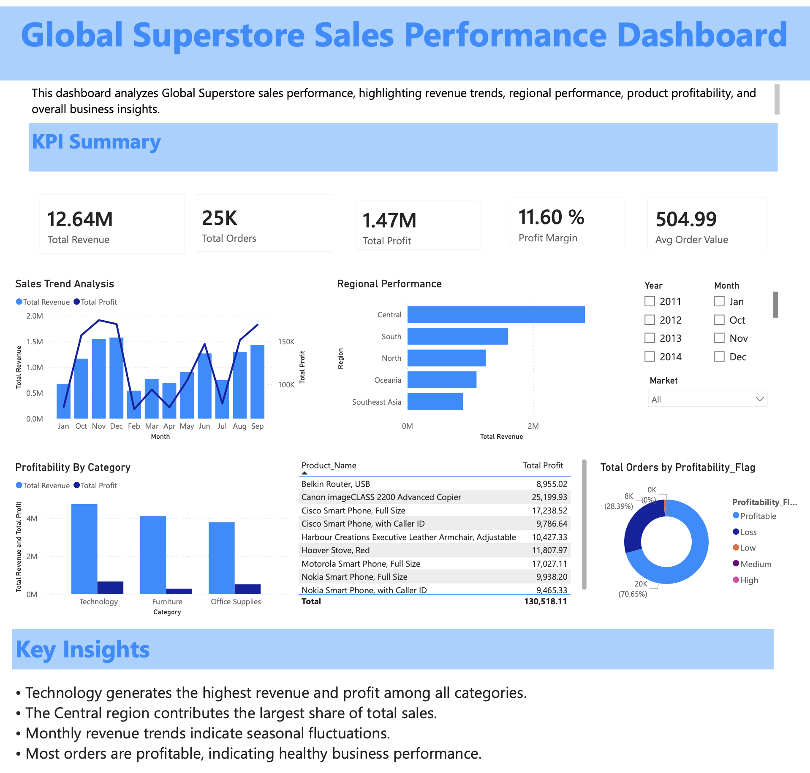

# Sales & Business Analytics Dashboard

A data analytics project built using **Excel and Power BI** to analyze sales performance, profitability, regional trends, and shipping efficiency using the Global Superstore dataset.

This project demonstrates data cleaning, business analysis, dashboard creation, and visualization skills commonly required in **Data Analyst and Business Analyst roles**.

---

# Project Objective

The goal of this project is to analyze retail sales data to identify:

* Revenue trends
* Profitability by product category
* Regional sales performance
* Customer segment behavior
* Shipping efficiency

The insights from this analysis can help businesses make **data-driven decisions to improve sales and operational efficiency.**

---

# Tools Used

* **Microsoft Excel**
* **Power BI**
* Data Cleaning Techniques
* Pivot Tables
* Dashboard Design
* Data Visualization

---

# Dataset

Dataset used: **Global Superstore Sales Dataset**

The dataset contains information about:

* Order Date
* Ship Date
* Region
* Category
* Sub-Category
* Sales
* Profit
* Customer Segment

---

# Excel Analysis

Excel was used for:

### Data Cleaning

Functions used:

=TRIM()
=CLEAN()

Techniques applied:

* Remove duplicates
* Sorting and filtering
* Column formatting

---

### Business Calculations

Shipping time calculation:

=NETWORKDAYS(Order_Date, Ship_Date)

Total Sales:

=SUM(Sales)

Total Profit:

=SUM(Profit)

Average Sales:

=AVERAGE(Sales)

Total Orders:

=COUNTA(Order_ID)

---

### Pivot Table Analysis

Pivot tables were used to analyze:

* Sales by Region
* Sales by Category
* Profit by Segment
* Monthly Sales Trends

---

# Excel Dashboard

The Excel dashboard provides insights into:

* Total Revenue
* Total Profit
* Sales Distribution by Category
* Regional Sales Performance
* Profit Trends

Key charts used:

* Bar Charts
* Line Charts
* Pie Charts
* Column Charts

---

# Power BI Dashboard

Power BI was used to create an interactive dashboard that includes:

* Sales Performance Overview
* Regional Sales Comparison
* Profit Analysis
* Category Performance
* Monthly Sales Trends

Interactive filters allow users to explore data dynamically.

# Dashboard Preview

---

# Key Insights

Some insights discovered from the analysis:

* Certain regions generate higher revenue but lower profit margins.
* Technology products contribute significantly to overall revenue.
* Shipping delays can impact customer satisfaction.
* Consumer segment drives the largest portion of sales.

---

# Repository Structure

Report.pbix → Power BI Dashboard File
Report.pdf → Dashboard Report
store.xlsx → Cleaned dataset used for analysis
README.md → Project documentation

---

# Skills Demonstrated

* Data Cleaning
* Data Analysis
* Business Intelligence
* Dashboard Development
* Data Visualization
* Analytical Thinking

---

# Author

Sahil Narula
Computer Science Student | Aspiring Data Analyst | Interested in Finance & Analytics

---

# Future Improvements

* Add SQL analysis
* Automate ETL process
* Add advanced Power BI visualizations
* Deploy dashboards online
