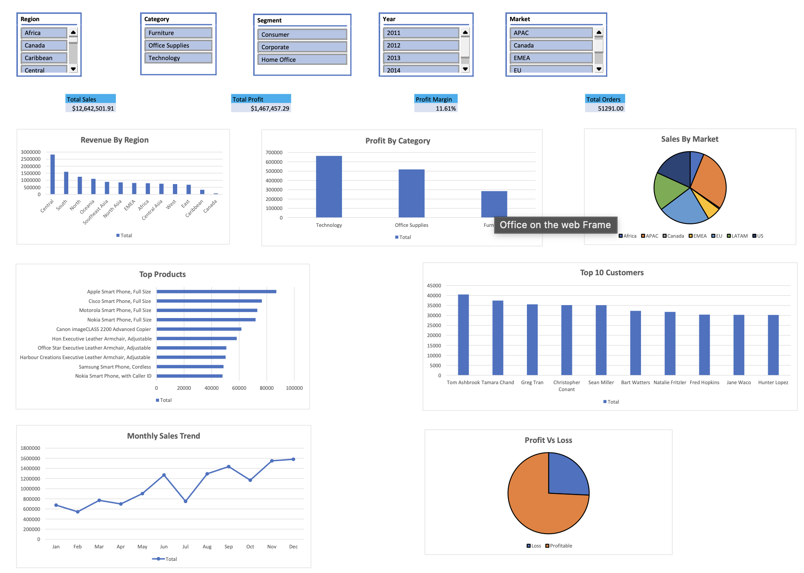

# Sales & Business Analytics Dashboard

## Dashboard Preview

### Excel Dashboard



### Power BI Dashboard


---

# Project Overview

This project analyzes retail sales data from the **Global Superstore dataset** to uncover insights related to revenue growth, profitability, regional performance, and shipping efficiency.

The analysis was conducted using **Microsoft Excel and Power BI**, focusing on transforming raw sales data into actionable business insights through data cleaning, aggregation, and interactive dashboards.

This project simulates a **real-world business analytics workflow**, demonstrating the type of analysis performed by **Data Analysts and Business Analysts in retail and e-commerce companies**.

---

# Business Objectives

The primary objective of this project was to answer key business questions:

* Which regions generate the highest revenue and profit?
* Which product categories drive the most sales?
* Which customer segments contribute most to revenue?
* Are shipping times affecting operational efficiency?
* What are the monthly trends in sales performance?

The goal was to convert raw transactional data into **insights that support data-driven decision making**.

---

# Dataset

Dataset used: **Global Superstore Sales Dataset**

Key fields used in analysis:

* Order Date
* Ship Date
* Region
* Category
* Sub-Category
* Sales
* Profit
* Customer Segment
* Order ID

The dataset represents retail transactions across multiple regions and product categories.

---

# Data Preparation (Excel)

Before performing analysis, the dataset was cleaned and structured in Excel.

### Cleaning Steps

* Removed extra spaces using `TRIM()`
* Cleaned non-printable characters using `CLEAN()`
* Removed duplicate rows
* Standardized column formats
* Sorted and filtered inconsistent records

### Feature Engineering

Shipping time was calculated to measure operational efficiency.

```
=NETWORKDAYS(Order_Date, Ship_Date)
```

Additional aggregations included:

* Total Sales
* Total Profit
* Average Sales per Order
* Total Number of Orders

---

# Exploratory Analysis (Pivot Tables)

Pivot tables were used to explore patterns and identify trends across different business dimensions.

Key analyses included:

* **Sales by Region**
* **Sales by Product Category**
* **Profit by Customer Segment**
* **Monthly Sales Trends**

These aggregations helped identify **high-performing segments and potential inefficiencies**.

---

# Excel Dashboard

An interactive Excel dashboard was built to provide a quick overview of sales performance.

### Metrics Included

* Total Revenue
* Total Profit
* Order Volume
* Average Sales

### Visualizations Used

* Bar Charts for category comparison
* Line Charts for monthly trends
* Pie Charts for segment distribution
* Column Charts for regional performance

The dashboard provides a **high-level operational view of business performance**.

---

# Power BI Dashboard

Power BI was used to build a more advanced **interactive analytics dashboard**.

### Dashboard Features

* Sales performance overview
* Regional sales comparison
* Profit analysis by category
* Customer segment analysis
* Monthly sales trends

Users can dynamically filter data by:

* Region
* Category
* Customer Segment
* Time period

This allows stakeholders to **explore sales performance interactively**.

---

# Key Insights

Several important insights emerged from the analysis:

* Some regions generate **high revenue but relatively lower profit margins**.
* The **Technology category contributes significantly to total sales**.
* The **Consumer segment accounts for the largest share of revenue**.
* Shipping time variability indicates **potential operational inefficiencies** in logistics.

These insights highlight opportunities for **profit optimization and operational improvement**.

---

# Repository Structure

```
Report.pbix
Report.pdf
store.xlsx
README.md
Excel.png
powerbi_dashboard.png
```

---

# Skills Demonstrated

* Data Cleaning and Preparation
* Business Data Analysis
* Dashboard Development
* Data Visualization
* Exploratory Data Analysis
* Business Intelligence Reporting

---

# About the Author

**Sahil Narula**

Computer Science Student
Interested in **Data Analytics, Finance, and Business Intelligence**

---

# Future Improvements

Potential enhancements for the project:

* Add SQL-based analysis
* Build an ETL pipeline for automated data processing
* Implement advanced Power BI DAX measures
* Deploy dashboards using Power BI Service
